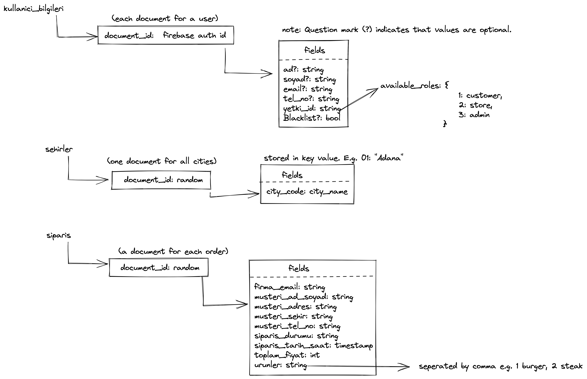

# Yazılım Mühendisliği: Java Projesi (DEPRECATED)
Namık Kemal Üniversitesi bilgisayar mühendisliği öğrencilerinin "Yazılım Mühendisliği" dersi için hazırladıkları bir projedir.
## Başlıklar
- [Projeye dair belgeler (Documentation)](./documentation)
- [Projenin Android Studio Dosyaları](./project_file)

Not: Projeyi indirdikten sonra kendi bilgisayarınızda, Android Studio içinde açarken "project_file" adlı dosyanın altında olan yemekSiparisApp dosyasını import'layın/açın. Direkt olarak indirdiğiniz dosyayı ("yazilimMuhendisligiProjesi" dosyasını) açmaya çalışırsanız Android Studio onu bir Android projesi olarak tanımayacaktır.

### Veritabanı Şeması

#### NOTE: This repository is no longer supported.